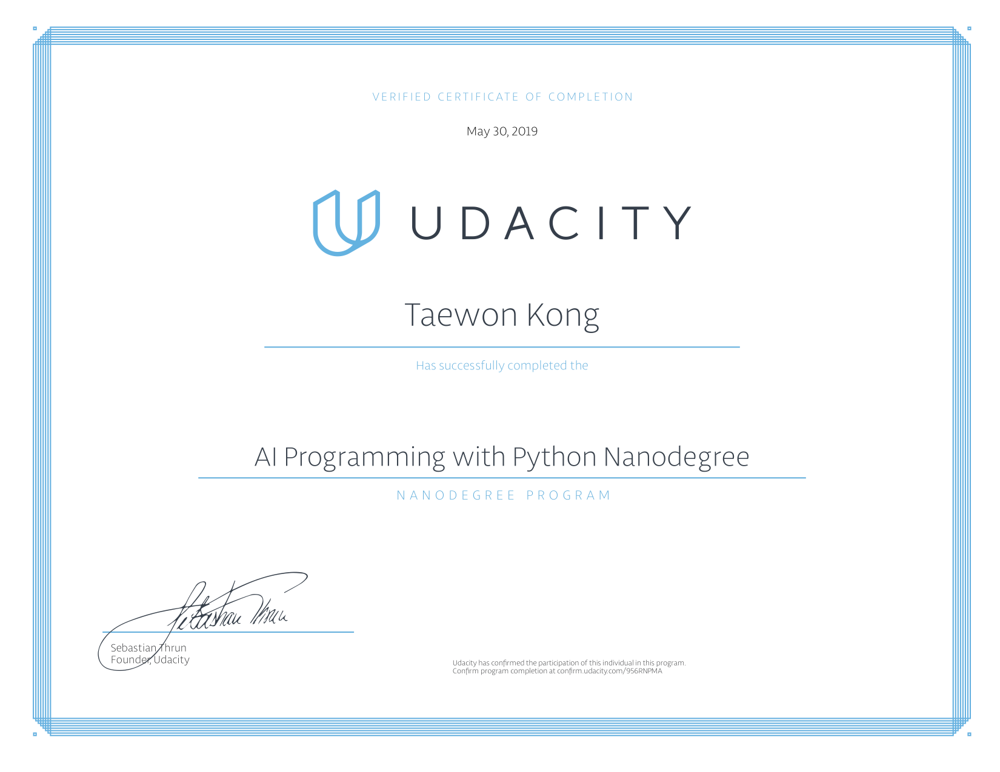

# ai_programming_with_python

Learned in this course:

- Python: data types and operators, control flow, functions, scripting, classes.
- Anaconda: learned to use Anaconda to manage packages and enviroments for use with Python.
- Numpy: learned the value of NumPy and how to use it to manipulate data for AI problems.
- Pandas: learned to use Pandas to load and process data for machine learning problems.
- Matplotlib: learned how to use Matplotlib to choose appropriate plots for one and two variables based on the types of data you have.
- Linear Algebra
- Calculus in Neural Networks
- Neural Networks: Acquired a solid foundation in deep learning and neural networks. Implement gradient descent and backpropagation in Python.
- Training Neural Networks: Learn about techniques for how to improve training of a neural network, such as: early stopping, regularization and dropout.
- Deep Learning with Pytorch: Learn how to use PyTorch for building deep learning models.
